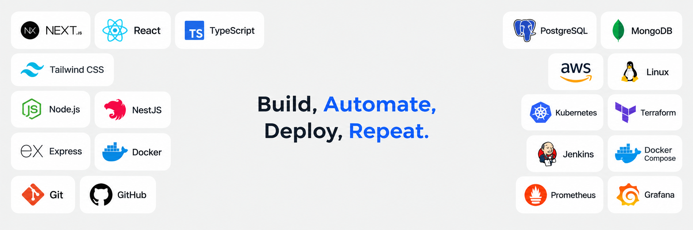

  

<h2 align="center">Hi, I'm Layss Kheir 👋</h2>

  <strong>DevOps Engineer · Cloud · Automation · CI/CD</strong>

  I build, automate, deploy, and maintain reliable infrastructure and delivery workflows.

  <a href="https://laysskheir.vercel.app/">Portfolio</a> ·
  <a href="https://www.linkedin.com/in/laysskheir">LinkedIn</a> ·
  <a href="mailto:laysskheir@gmail.com">Email</a>

👨‍💻 About Me

I'm a DevOps Engineer focused on automation, cloud infrastructure, CI/CD, containers, Linux, and reliable production deployments.

🌍 Based in Lebanon · Open to remote opportunities

⚙️ Focused on cloud infrastructure, deployment, automation, and system reliability

🐳 Experienced with containerized environments and Docker-based workflows

☁️ Working with AWS, Linux, networking, and server infrastructure

🔄 Building CI/CD pipelines and improving development-to-production workflows

📚 Continuously improving my skills in Kubernetes, Terraform, Jenkins, monitoring, and cloud engineering

🛠️ DevOps Stack

Cloud & Infrastructure

  

AWS · EC2 · S3 · Route 53 · CloudFront · IAM · Linux · Nginx

Containers & Orchestration

  

Docker · Docker Compose · Kubernetes · Minikube

Infrastructure as Code

  

Terraform · OpenTofu · Infrastructure as Code

CI/CD & Automation

  

GitHub Actions · Jenkins · Bash · Git · GitHub · CI/CD · Deployment Automation

Monitoring & Reliability

Monitoring · Logging · Health Checks · Performance · Reliability · Production Troubleshooting

🎯 What I Care About

I enjoy turning manual infrastructure and deployment work into repeatable, automated workflows.

Build → Automate → Deploy → Monitor → Improve

My focus is on reliable systems, clean deployment processes, scalable infrastructure, security, and reducing operational overhead.

💼 Experience

DevOps & Cloud Experience · Skew.digital
Remote · 2025–2026

Worked with cloud infrastructure, deployment workflows, backend environments, APIs, databases, integrations, and production systems. Focused on automation, deployment, troubleshooting, and keeping applications reliable in production.

🎓 Education

BSc in Management Information Systems
Lebanese University · 2019–2022

🌐 Languages

English — Fluent · Arabic — Native · French — Intermediate

📊 GitHub

  

  

  <strong>Build. Automate. Deploy. Repeat. 🚀</strong>

